# Maven_Movies_Rental_Business_DA
Data analysis of movies CD/DVD rental (transactions) and inventory

# Maven Movies Data Analysis: Enhancing Insights for a Rental Business

## Project Overview:
This project analyzes a movie rental business's database to provide actionable insights for improving operations, marketing strategies, and inventory management. The dataset is hosted in the MAVENMOVIES database, and SQL was extensively used for exploratory data analysis (EDA), schema understanding, and answering business-critical ad-hoc queries.

## Project Objectives:

### Customer Insights:

Identify customer details (names, emails) for targeted marketing campaigns.
Analyze customer rental patterns to improve customer engagement.

### Movie Inventory Analysis:

Explore the rental inventory and classify movies based on rental rates and availability.
Provide recommendations for expanding the movie collection based on popularity and rental rates.
Revenue Optimization:

Analyze rental rates to identify trends and the profitability of various pricing categories.
Determine the most rented movie categories and ratings to maximize revenue.

### Operational Efficiency:

Help track and manage movie inventory effectively.
Highlight gaps in the inventory and optimize stock levels.

# Tools & Library Used
 &nbsp;

# Query Task

1. "How can we extract the first name, last name, and email address of all customers to prepare a comprehensive contact list for the marketing team?"

 &nbsp;

2. "What is the total number of movies in the inventory that are available for rent at the lowest rental rate of $0.99?"

 &nbsp;

3. "How can we categorize all movies based on their rental rates and determine the count of movies in each category?"

 &nbsp;

4. "Which movie rating (e.g., PG, PG-13, R) has the highest number of titles in the inventory, and how can this information help optimize inventory management?"

 &nbsp;

5. "What is the total count of PG-rated movies that have been rented, and what does this indicate about customer preferences?"

 &nbsp;

6. "Can you provide a list of films categorized by their genre, along with their language and film name?"

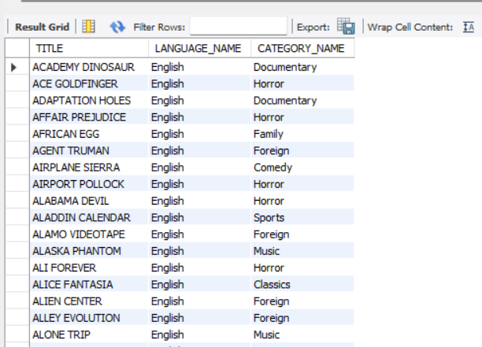 &nbsp;

7. "Can you provide a list of movies and the number of times each has been rented out?"

 &nbsp;

8. "What are the top 10 highest-grossing films, and how much revenue has each generated?"

 &nbsp;

9. "Can we identify the store with the highest historical revenue, and how does it compare to others in the same region?"

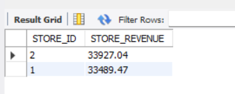 &nbsp;

10. "How many movie rentals did we have in total each month over the past year?"

 &nbsp;

11. "How do we determine the rewards for users who have rented 30 or more times, and what details about their preferences should we consider?"

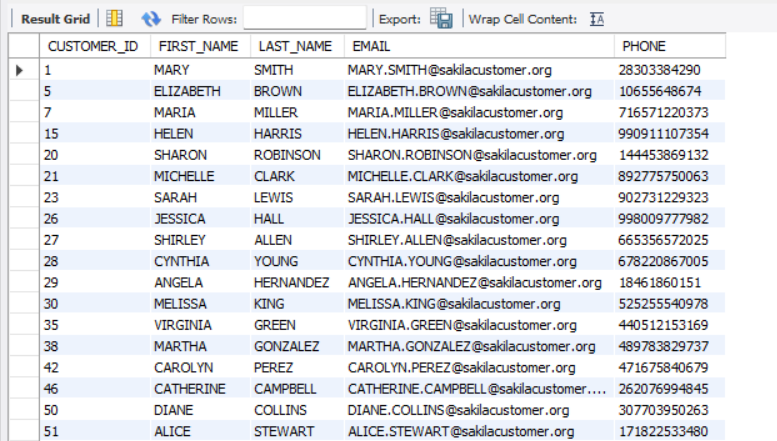 &nbsp;

12. "Could you pull all payments from our first 100 customers (Based on customers id)"

 &nbsp;

13. "Now I’d love to see just payments over $5 for those same customers, since January 1, 2006"

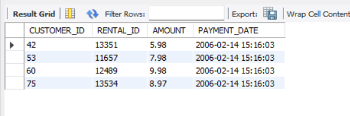 &nbsp;

14. "Now, could you please write a query to pull all payments from those specific customers, along with payments over $5, from any customer?"

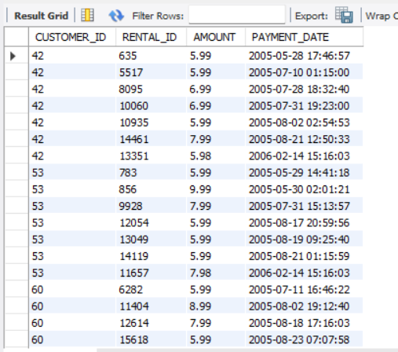 &nbsp;

15. "We need to understand the special features in our films. Could you pull a list of films which include a Behind the Scenes special feature?"

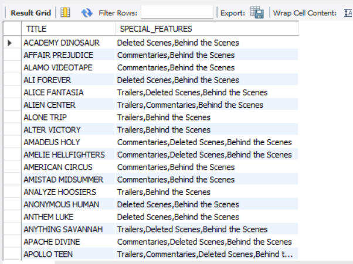 &nbsp;

16. "Which customer qualifies as the top spender, and what rewards or points should we offer them?"

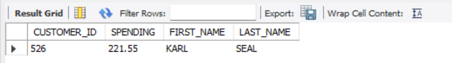 &nbsp;

17. "Could you please pull a count of titles sliced by rental duration?"

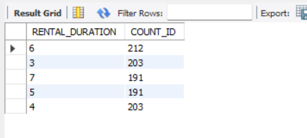 &nbsp;

18. "How do movie ratings and lengths correlate with rental demand (number of movies rented) across various rental periods?"

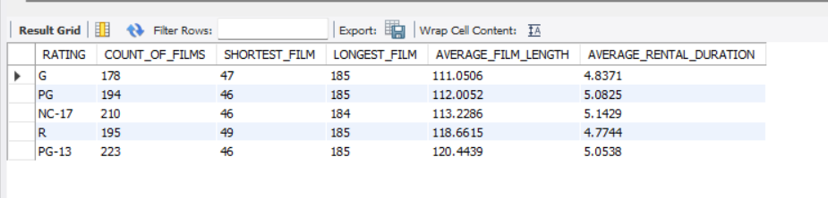 &nbsp;

19. "I’m wondering if we charge more for a rental when the replacement cost is higher. Can you help me pull a count of films, along with the average, min, and max rental rate, grouped by replacement cost?"

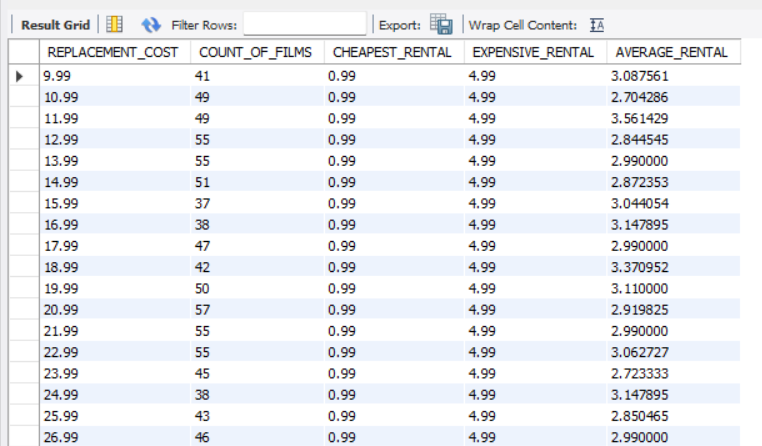 &nbsp;

20. "Which movies should be recommended to individuals based on specific demographics like cultural background or interests?"

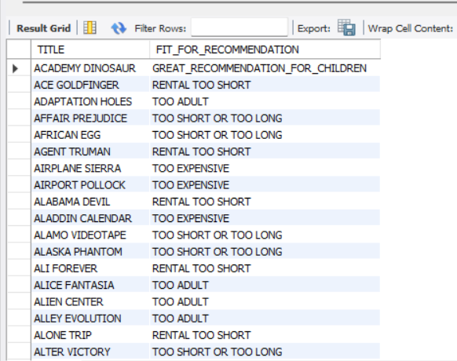 &nbsp;

21. “I’d like to know which store each customer goes to, and whether or not they are active. Could you pull a list of first and last names of all customers, and label them as either ‘store 1 active’, ‘store 1 inactive’, ‘store 2 active’, or ‘store 2 inactive’?”

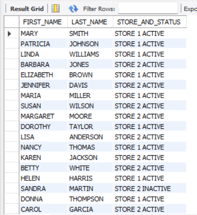 &nbsp;

22. “Can you pull for me a list of each film we have in inventory? I would like to see the film’s title, description, and the store_id value associated with each item, and its inventory_id. Thanks!”

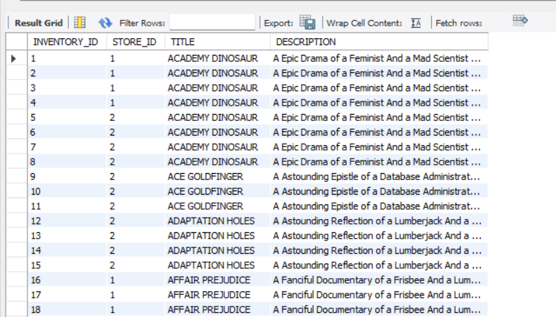 &nbsp;

23. "Can you list the movies that [FIRST_NAME] [LAST_NAME] has been part of, and how many are there in total?"

 &nbsp;

24. “One of our investors is interested in the films we carry and how many actors are listed for each film title. Can you pull a list of all titles, and figure out how many actors are associated with each title?”

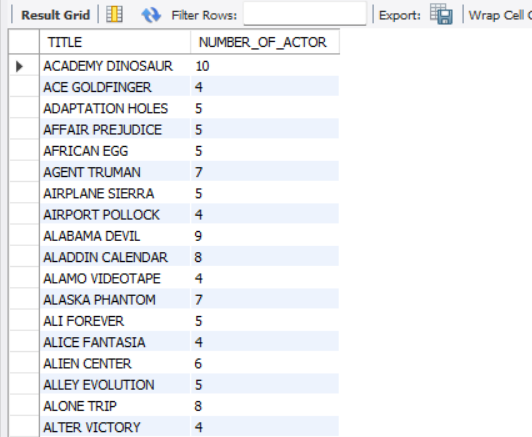 &nbsp;

25. “Customers often ask which films their favorite actors appear in. It would be great to have a list of all actors, with each title that they appear in. Could you please pull that for me?” 

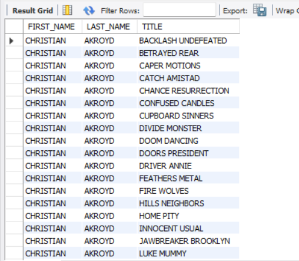 &nbsp;

26.“The Manager from Store 2 is working on expanding our film collection there. Could you pull a list of distinct titles and their descriptions, currently available in inventory at store 2?”

 &nbsp;

27.  “We will be hosting a meeting with all of our staff and advisors soon. Could you pull one list of all staff and advisor names, and include a column noting whether they are a staff member or advisor? Thanks!”

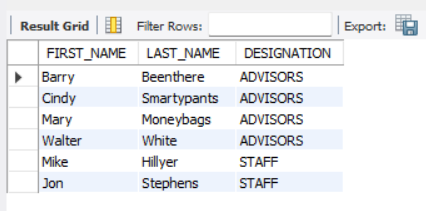 &nbsp;
